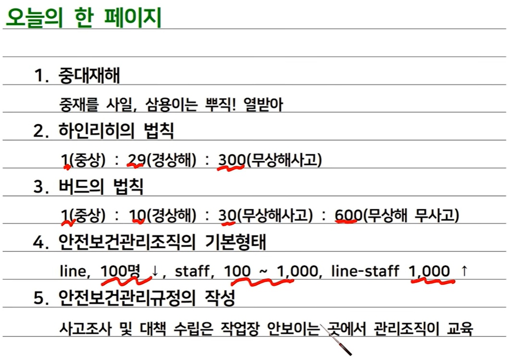
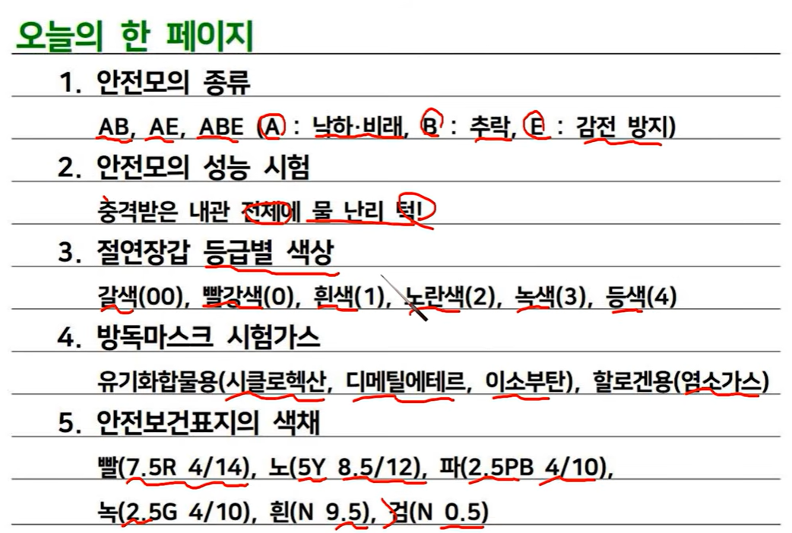

### 산업재해
- 노무를 제공하는 사람이~

 

### 중대재해
- 산업재해 중 사망 등 재해정도가 심하거나 다수의 재해자가 발생한 경우~
- 사망자 1명 이상
- 3개월 이상의 요양이 필요한 부상자가 동시에 2명 이상
- 부상자 또는 직업성 질병자가 동시에 10명 이상

 

### 하인리히 
- 1: 29: 300

 

### 버드
- 1: 10: 30: 600
  - 600 : 무상해 무사고 (위험순간, 아차사고, 잠재위험요소)

 

### KOSHA Guide
- 한국산업안전공단

 

### 안전보건관리조직 기본 형태
- 라인형 (100명 미만)
  - 장점 : 명령개통 간단, 지시전달 신속 정확
  - 단점 : 안전에 관한 전문지식 부족
- 스태프형 (100~ 1000 미만)
  - 장점 : 안전지식 및 기술축적 용이
  - 단점 : 공장장과 안전스탭의 사이가 안좋음
- 라인 스태프형 (1000명 이상)
  - 장점 : 라인형, 스태프형의 장점을 가지고 옴
  - 단점 : 안전스탭의 월권 행위 우려

 

### 산업안전보건위원회 및 안전보건 관리책임자 를 두어야 하는 건설공사의 기준
- 산업안전보건 위원회 : 공사금액 120억원 이상 (토옥은 150억원 이상)
- 안전보건 관리책임자 : 공사금액 20억원 이상

 

### 산업안전보건위원회 구성
- 근로자위원
  - 근로자대표
  - 근로자대표가 지명하는 1명 이상의 명예산업안전감독관
  - 근로자대표가 지명하는 9명 이내의 해당 사업장의 근로자
- 사용자위원
  - 해당 사업의 대표자
  - 안전관리자 1명, 보건 관리자 1명, 산업보건의
  - 해당 사업의 대표자가 지명하는 9명 이내의 해당 사업장 부서의 장
- 정기회의는 분기마다 진행

 

### 노사협의체의 설치 대상 기업
- 공사금액이 120억원(토옥은 150억원) 이상인 건설공사 

 

### 노사협의체의 운영
- 정기회의 2개월 마다
- 임시회의 : 위원장이 필요하다고 인정할때 마다

 

### 작업장의 순회점검
- 2일 1회 이상
  - 건설업, 제조업, 토사석 광업, 금속 및 비금속 원료 재생업
  - 서적, 잡지 인쇄물 출판업, 음악 오디오물 출판업
- 1주일 1회 이상
  - 위 사업장 외

 

### 도급사업의 합동 안전 보건점검 실시 횟수
- 2개월 1회 이상
  - 건설업
  - 선박 및 보트 건조업
- 분기별 1회 이상
  - 위 사업 외

 

### 안전보건관리규정 작성시기
- 사유가 발생한 날로부터 30일 이내

 

### 안전보건관리규정의 작성
- 안전 및 보건에 관한 관리조직과 그 직무에 관한 사항
- 안전보건교육에 관한 사항
- 작업장의 안전 및 보건 관리에 관한 사항
- 사고 조사 및 대책 수립에 관한 사항
- 그 밖에 안전 및 보건에 관한 사항

 

 

### 안전모
- 종류
  - AB
  - ABE
  - AE
- 기호 뜻
  - A : 물체의 낙하, 비래(날아서 옴)
  - B : 추락
  - E : 감전 방지용(FRP)

 

### 안전모 구조 > 착장체
- 머리 받침 고리
- 머리 받침 끈
- 머리 고정대

 

### 안전모의 성능 시험
> 충격! 내관 전체에서 물 난리 턱!
- (충)격 흡수성 : 4,450N 초과하지 않을 것
- (내관)통성 : AB 관통거리 11.1mm 이하, AE, ABE 관통거리 9.5mm 이하
- (내전)압성
- (내수)성 : 질량 증가율 1% 미만
- (난)연성 : 불꽃을 내며 5초이상 타지 않아야 한다
- (턱)끈풀림 : 150N 이상 250N 이하에서 턱끈이 **풀려야** 한다

 

### 안전대의 종류 및 사용구분
- 벨트식
  - U자 걸이
  - 1개 걸이  
- 안전그네식
  - U자 걸이
  - 1개 걸이
  - 안전 블록
  - 추락 방지대

 

### 안전장갑 > 절연장갑
- 직류(V) = 교류(V) * 1.5
- 등급별 색상 : 갈 < 빨 < 흰 < 노 < 녹 < 등(귤색)

 

### 송기마스크
- 산소 농도 18% 미만 일 때 착용
- 유해물질 농도 2% 이상 일 때 착용
- 암모니아 3% 이상 일 때 착용

 

### 귀마개, 귀덮개
- 1종 : EP-1 / 저음~ 고음 차단
- 2종 : EP-2 / 고음만 차단

 

